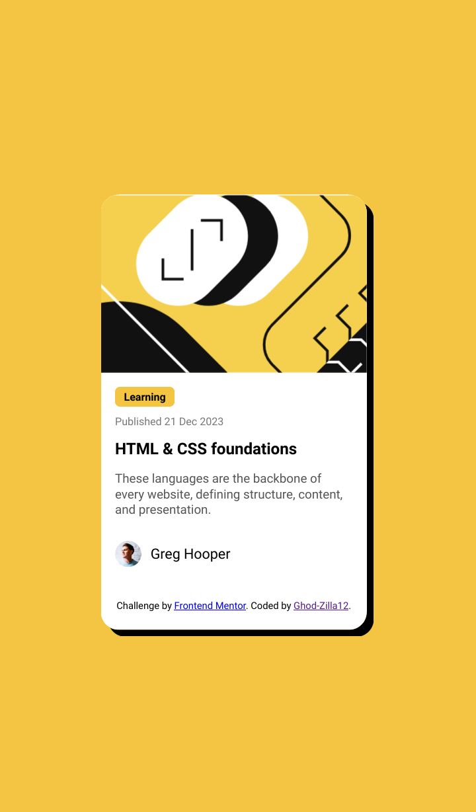

# Frontend Mentor - Blog preview card solution

This is a solution to the [Blog preview card challenge on Frontend Mentor](https://www.frontendmentor.io/challenges/blog-preview-card-ckPaj01IcS). Frontend Mentor challenges help you improve your coding skills by building realistic projects. 

## Table of contents

- [Overview](#overview)
  - [The challenge](#the-challenge)
  - [Screenshot](#screenshot)
  - [Links](#links)
- [My process](#my-process)
  - [Built with](#built-with)
  - [What I learned](#what-i-learned)
  - [Continued development](#continued-development)
- [Author](#author)


## Overview

### The challenge

Users should be able to:

- See hover and focus states for all interactive elements on the page

### Screenshot




### Links

- Live Site URL: []

## My process

### Built with

- Semantic HTML5 markup
- CSS custom properties
- Flexbox
- CSS Grid
- Mobile-first workflow
- [React](https://reactjs.org/) - JS library
- [Next.js](https://nextjs.org/) - React framework
- [Styled Components](https://styled-components.com/) - For styles


### What I learned

```html
<h1>Some HTML code I'm proud of</h1>
  <div style="width: 336px; height: 201px;">
    <svg xmlns="http://www.w3.org/2000/svg" width="336" height="201" fill="none" viewBox="0 0 336 201">
      <svg xmlns="http://www.w3.org/2000/svg" width="336" height="201" fill="none" viewBox="0 0 336 201"><g clip-path="url(#a)"><path fill="#F4D04E" d="M0 .5h336v200H0z"/><rect width="139" height="95" x="87.996" y="77.729" fill="#fff" rx="47.5" transform="rotate(-45 87.996 77.729)"/><rect width="139" height="95" x="54.055" y="77.729" fill="#111" rx="47.5" transform="rotate(-45 54.055 77.729)"/><path fill="#111" d="M234.864 209.036 451.4-7.5l67.175 67.175-216.536 216.536z"/><rect width="139" height="95" x="20.114" y="77.729" fill="#fff" rx="47.5" transform="rotate(-45 20.114 77.729)"/><rect width="204.19" height="270.554" fill="#111" rx="102.095" transform="scale(-1 1) rotate(45 -103.887 14.564)"/><path stroke="#fff" stroke-width="3" d="m6.69-357.5 135.583 135.727c12.481 12.494 12.481 32.737 0 45.231L-45.544 11.475c-12.481 12.494-12.481 32.737 0 45.23L107.088 209.5"/><path stroke="#111" stroke-width="3" d="M69.965 71.719v23.334h23.334M136.079 52.273V28.94h-23.334M102.845 38.838v46.67M210.364-37.5l60.873 60.873c12.497 12.496 12.497 32.758 0 45.254l-77.745 77.746c-12.497 12.496-12.497 32.758 0 45.254l69.872 69.873"/><path stroke="#111" stroke-width="3" d="m253.339 149.574-12.144 12.145 14.256 14.257v12.672h12.673l13.729 13.729 12.145-12.145M278.685 124.228l-12.145 12.145 14.257 14.257v12.673h12.673l13.729 13.729 12.145-12.145M304.031 98.883l-12.145 12.144 14.257 14.257v12.673h12.673l13.729 13.729 12.144-12.145M329.376 73.537l-12.145 12.145 14.257 14.257v12.672h12.673l13.729 13.729 12.145-12.144"/><path stroke="#fff" stroke-width="5" d="m354.722 48.191-12.145 12.145 14.257 14.257v12.673h12.673l13.729 13.729 12.145-12.145"/><mask id="b" width="285" height="285" x="234" y="-8" maskUnits="userSpaceOnUse" style="mask-type:alpha"><path fill="#111" d="M234.864 209.036 451.4-7.5l67.175 67.175-216.536 216.536z"/></mask><g stroke="#fff" mask="url(#b)"><path stroke-width="3" d="m253.339 149.574-12.144 12.145 14.256 14.257v12.672h12.673l13.729 13.729 12.145-12.145M278.685 124.228l-12.145 12.145 14.257 14.257v12.673h12.673l13.729 13.729 12.145-12.145M304.031 98.883l-12.145 12.144 14.257 14.257v12.673h12.673l13.729 13.729 12.144-12.145M329.376 73.537l-12.145 12.145 14.257 14.257v12.672h12.673l13.729 13.729 12.145-12.145"/><path stroke-width="5" d="m354.722 48.191-12.145 12.145 14.257 14.257v12.673h12.673l13.729 13.729 12.145-12.145"/></g></g><defs><clipPath id="a"><path fill="#fff" d="M0 .5h336v200H0z"/></clipPath></defs></svg>
    </svg>
  </div>
```
```css
 .attribution {
  font-size: 11px;
  text-align: center;
  padding: 20px 0; /* Gives it some breathing room from the bottom edge */
  width: 100%;
}
```


### Continued development

I'm still finding it a bit challenging navigating between .svg, png, jpg and webp files and how to bring them into my html.


## Author
- Frontend Mentor - [@Ghod-Zilla12](https://www.frontendmentor.io/profile/Ghod-Zilla12)

